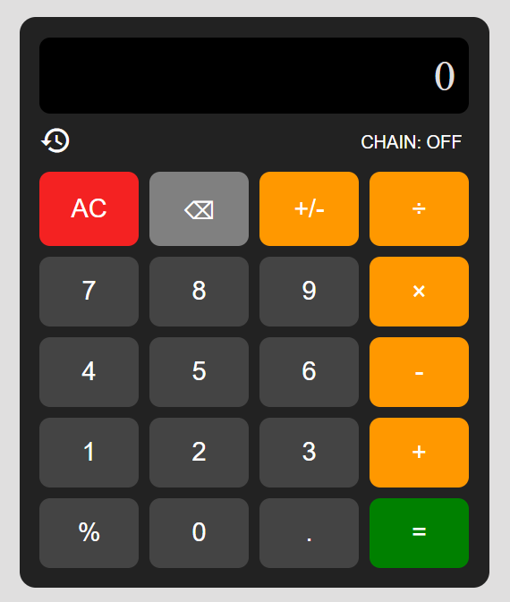

# 🧮 CalcMe

A sleek, interactive **web-based calculator** with history tracking, chain mode calculations, and keyboard support.  
Built with **HTML, CSS, and JavaScript** — lightweight, responsive, and easy to use.  

---

## 🚀 Features

- ✅ **Basic arithmetic**: Addition, subtraction, multiplication, division  
- ✅ **Percentage support** (`%`)  
- ✅ **Sign toggle** (`+/-`)  
- ✅ **Chain Mode** (left-to-right evaluation, ignores BODMAS rules)  
- ✅ **Normal Mode** (BODMAS order of operations)  
- ✅ **Calculation history** (expandable/collapsible)  
- ✅ **Keyboard support** — type numbers & operators directly  
- ✅ **Responsive design** for desktop & mobile  

---

## 📸 Preview  

  

---

## Live Demo
👉 [GitHub Pages Link](https://ruthiezgit.github.io/my-calculator/)

---

## 🔧 Installation & Usage  

1. Clone this repository:  
   ```bash
   git clone https://github.com/yourusername/calcme.git
   cd calcme

2. Open the project:
Just double-click index.html or serve it with a local server (e.g. VS Code Live Server).

⌨️ Keyboard Shortcuts

| Key            | Action                |
| -------------- | --------------------- |
| `0-9`          | Enter digits          |
| `+ - * /`      | Operators             |
| `%`            | Percentage            |
| `Enter` or `=` | Calculate result      |
| `Backspace`    | Delete last character |
| `Escape`       | Clear all (`AC`)      |


🛠️ Tech Stack

HTML5 for structure
CSS3 (Flex/Grid) for layout & styling
Vanilla JavaScript for logic


🤝 Contributing

Pull requests are welcome!
If you find a bug or have an idea, open an issue or submit a PR.


📜 License

Copyright © 2025 Designed by Ruth — free to use and modify.
